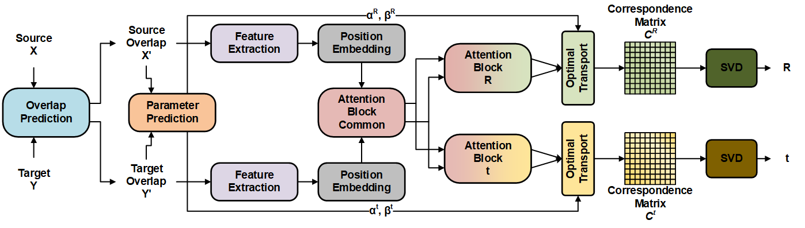

# DBDNet:Partial-to-Partial Point Cloud Registration with Dual Branches Decoupling

This is an official implementation of [*DBDNet:Partial-to-Partial Point Cloud Registration with Dual Branches Decoupling*](https://www.sciencedirect.com/science/article/pii/S0950705124004982) that is accepted to Knowledge-Based Systems.

## Abstract
Point cloud registration plays a crucial role in various computer vision tasks. In this paper, we concentrate on two aspects of the point cloud registration problem: rotation–translation decoupling and partial overlapping. To eliminate the error introduced by rotation and translation mutual interference, we propose a dual branches structure that produces separate correspondence matrices for rotation and translation. These dual branches are guided by distinct loss functions, facilitating independent calculation of rotation and translation. For partial-to-partial registration, we consider overlap prediction as a preordering task before the registration procedure. We propose an overlap predictor to initially identify common parts within the source and target point clouds. Subsequently, only these overlapping points are routed to the registration module. To accurately predict pointwise masks, we employ an overlap predictor that benefits from explicit feature interaction introduced by the powerful attention mechanism. Additionally, we design a multi-resolution feature extraction network to capture patterns in various scales, thereby enabling our model to exploit both local and global features. Experimental results on both synthetic and real-world datasets validate the effectiveness of our proposed method.



## Installation
First, create the conda environment.
```
conda create -n dbd python=3.9
conda activate dbd
pip install -r requirements.txt
```
Then, install the [pointnet_ops_lib](model/pointnet_ops_lib/README.md) and [pointnet2_ops_lib](model/pointnet2_ops_lib/README.md) in model folder.

## Data Preparation
The ModelNet40 data can be found from [modelnet40_ply_hdf5_2048](https://shapenet.cs.stanford.edu/media/modelnet40_ply_hdf5_2048.zip).

The 3DMatch data can be found from [Predator project page](https://overlappredator.github.io/), the `.pkl` files can be found from [here](https://github.com/prs-eth/OverlapPredator/tree/main/configs/indoor).

Please organize the data to `./data` following the example data structure as:
```
data/
├── 3dmatch/
    └── indoor/
        ├── train/
        ├── test/
        ├── 3DLoMatch.pkl
        ├── 3DMatch.pkl
        ├── train.pkl
        └── valid.pkl
└── modelnet40_ply_hdf5_2048
```
Then generate the required overlap files by:
```
python tools/3dmatch_overlap_compute.py
```
The generated files will located in `data/3dmatch/indoor` folder.

## Train
Train the overlap model.
```
python train.py --config config modelnet40_overlap.yaml
python train.py --config config 3dmatch_overlap.yaml
```
Train the registration model.
```
python train.py --config config modelnet40.yaml
python train.py --config config 3dmatch.yaml
```

## Test
We provide the pre-trained model [checkpoints](https://pan.baidu.com/s/1rbIxqa7X9JKFrcfBoPeSsg?pwd=c2qe), download and put the weight files to `./ckpt` folder.
```
python test.py --config config/modelnet40.yaml --ckpt ckpt/modelnet40_noise.pth
python test.py --config config/3dmatch.yaml --ckpt ckpt/3dmatch.pth
python test.py --config config/3dlomatch.yaml --ckpt ckpt/3dmatch.pth
```

## Cite
If you find this code useful for your work, please consider citing:
```
@article{li2024dbdnet,
  title={DBDNet: Partial-to-partial point cloud registration with dual branches decoupling},
  author={Li, Shiqi and Zhu, Jihua and Xie, Yifan},
  journal={Knowledge-Based Systems},
  pages={111864},
  year={2024},
  publisher={Elsevier}
}
```

## Acknowledgement
We thank the authors of the [RPMNet](https://github.com/yewzijian/RPMNet), [OverlapPredator](https://github.com/prs-eth/OverlapPredator), [RegTR](https://github.com/yewzijian/RegTR), [FINet](https://github.com/hxwork/FINet_Pytorch), [PointTransformerV2](https://github.com/Gofinge/PointTransformerV2), [Pointnet2_PyTorch](https://github.com/erikwijmans/Pointnet2_PyTorch) for open sourcing their codes.